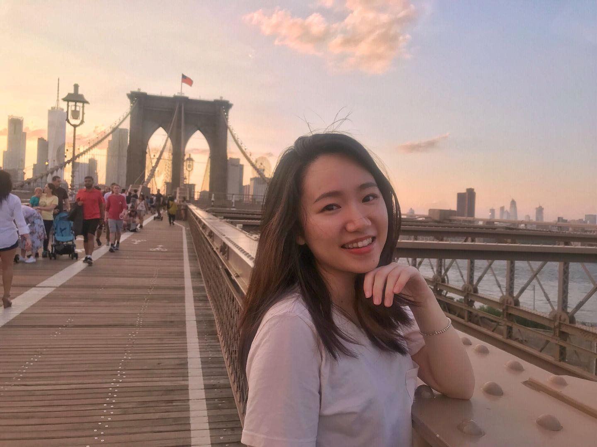

#### *MS Candidate in Biostatistics of Columbia University Medical Center*

- I received a BS in Life Science from Wuhan University, China in 2017. Now I am a Second-year MS student in Biostatistics at Columbia University Medical Center.

- Right now I am a Graduate Teaching Assistant for course Data Science I (Instructor: Jeff Goldsmith). Also I am working as Reseach Assistant at Department of Biostatistics with a focus on functional data analysis.

- Previously I have worked for pharmaceutical company and medical center. After competed first year of graduate study,I worked as Biostatistics and data science summer intern at Boehringer Ingelheim. At there I strengthened my **SAS** programming skills as well as learned clinical trial design. In the last year of my undergrad, I internd at UT Southwestern Medical Center, Dallas and worked in Quantitative Biomedical Research Center. The project is about EMR data analysis for renal cell carcinoma (a kind of kidney cancer). I used **R programming** to clean and visualize EMR data and built predictive model for patients survival rate with longitudinal data. The full description of my projects can be viewd on my [Linkedin](https://www.linkedin.com/in/jingxuanh/).

- I completed all undergraduate courses within five semesters and spent the other three semester to study abroad.

- I have been playing violin for 17 years! I was a violin player for university's symphony orchestra when I was an undergrad. Right now I also play violin at Columbia University Medical Center Symphony Orchestra.

- I was the president of college debate team when I was in undergrad. I love brainstorming and critical thinking.

- My full resume is avalable [here](https://jingxuanh.github.io/about.html)